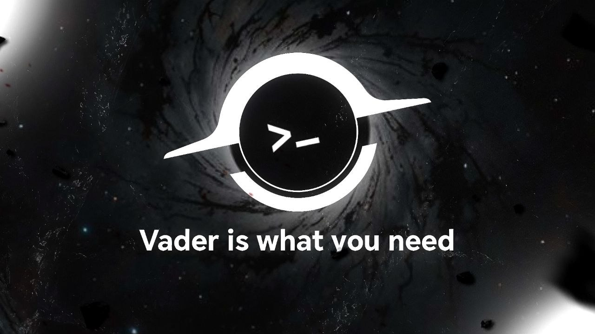

<p align="center">
  
</p>

<h1 align="center">Vader</h1>

<p align="center">
  <b>The AI-native IDE for agents you can trust.</b><br>
  A real coding agent with a hard policy engine in front of every action, no telemetry, and any model you want.
</p>

<p align="center">
  <a href="https://github.com/qwzx4893-stack/Vader/actions/workflows/ci.yml"></a>
  <a href="https://github.com/qwzx4893-stack/Vader/actions/workflows/security-scan.yml"></a>
  <a href="https://github.com/qwzx4893-stack/Vader/actions/workflows/windows-e2e.yml"></a>
  <a href="https://github.com/qwzx4893-stack/Vader/releases"></a>
  <a href="./LICENSE.txt"></a>
  
  
  
  <a href="https://github.com/qwzx4893-stack/Vader/stargazers"></a>
  <a href="https://github.com/qwzx4893-stack/Vader/issues"></a>
  
</p>

<p align="center">
  <a href="#why-vader">Why Vader</a> ·
  <a href="#what-you-get">Features</a> ·
  <a href="#download">Download</a> ·
  <a href="#build-from-source">Build</a> ·
  <a href="#how-vader-is-verified">Verification</a> ·
  <a href="#documentation">Docs</a> ·
  <a href="./README.ar.md">العربية</a>
</p>

---

## Why Vader

Most AI editors are a chat window next to your code. Vader treats the agent the way you would treat a new engineer with real access to your files and your terminal: **never trust, always gate.**

- **A hard policy engine, not a suggestion.** Every file write, delete and terminal command is checked against allow / ask / deny rules *before* it runs, independent of what the model decides and independent of the approval prompt. Paths are resolved through symbolic links and `..`, so a link to `~/.aws` or `src/../../etc/...` cannot walk around a rule. Rules marked `locked` cannot be switched off from settings.
- **Privacy by default.** No telemetry, no analytics, no "phone home". The browser the agent drives and the editor itself are tested against a network trace to make sure they stay quiet. Provider keys are encrypted with the OS keychain.
- **Bring your own model.** OpenAI, Anthropic, Gemini, OpenRouter, Mistral, DeepSeek, xAI, Groq, Qwen, Kimi, MiniMax, Ollama, LM Studio, vLLM and any OpenAI-compatible endpoint, through one transport layer with real cancellation, timeouts and error classification.
- **Verified, not just claimed.** A test suite drives the *installed* Windows app, including a run against a real model, and a "model in the loop" harness lets you (or an AI agent) play the model to see exactly what a keyed model would experience. See [How Vader is verified](#how-vader-is-verified).

## What you get

| | |
|---|---|
| **A real agent** | Reads and edits files, runs commands, drives a browser (Playwright, 15 tools), speaks MCP, searches a federated marketplace of extensions, skills and MCP servers. |
| **Multi-agent** | Permanent named agents with their own instructions, tool limits and file scope; one-off sub-agents; parallel tasks isolated in git worktrees. |
| **Checks its own work** | An independent, read-only verification agent judges whether a task actually succeeded, with a bounded verify, repair, re-verify loop. |
| **Context that stays relevant** | A per-turn context engine ranks symbols, diagnostics and git history; memory and structured compaction keep long sessions coherent. |
| **The editor you know** | The full VS Code workbench: terminal, diff and review flow, inline Ctrl+K edits, apply, checkpoints, extensions from Open VSX. |
| **Policy you can read** | Plain rules (`ask` before secrets, `.vscode/tasks.json`, git hooks, installs; `deny` for catastrophic commands and system files), editable in settings, enforced in code. |

## Download

The [**Releases**](https://github.com/qwzx4893-stack/Vader/releases) page has the published Windows installer. Newer builds (the current editor base, with everything described here) are produced by the [Windows Build](https://github.com/qwzx4893-stack/Vader/actions/workflows/windows-build.yml) workflow as a downloadable installer artifact on every run, and will be published there as releases. macOS and Linux use the same pipeline; until they are published you can [build from source](#build-from-source).

> Installers are currently **unsigned**. Windows SmartScreen will warn on first run.

## Quick start

1. Install and open Vader.
2. In the first-run setup pick a provider (or point it at a local one such as Ollama) and paste a key.
3. Open a folder, switch the chat to **Agent** mode and describe what you want. Edits and commands ask before they run (you decide how much to auto-approve).

## Build from source

Vader is an Electron application. Requirements: Node.js 24 (see `.nvmrc`), Git, and the usual native build tools for your OS.

```bash
git clone https://github.com/qwzx4893-stack/Vader.git
cd Vader
npm install
npm run buildreact     # the React chat / settings UI
npm run buildcline     # the agent runtime bundle for the renderer
npm run compile
./scripts/code.sh      # macOS / Linux   (scripts\code.bat on Windows)
```

Before changing anything read [`AGENTS.md`](./AGENTS.md) and [`CONTRIBUTING.md`](./CONTRIBUTING.md). The minimum bar is a clean `node_modules/.bin/tsc -p src/tsconfig.json --noEmit` and the regression tests listed in [`.github/workflows/ci.yml`](./.github/workflows/ci.yml).

## How Vader is verified

- **Regression tests on every push** ([CI](./.github/workflows/ci.yml)): policy bypass attempts (symbolic links, `..`, regex bombs, obfuscated commands), provider wire formats against the real vendor SDKs, privacy flags, packaged-import checks, import cycles, and an audit that requires **zero known advisories** in all 58 lockfiles.
- **The real app, end to end** ([Windows E2E](./.github/workflows/windows-e2e.yml)): the installed app is driven through its UI with a scripted model (every tool, edits, approvals, restart persistence, fault injection) and with a small real model.
- **Security scanning** ([Security Scan](./.github/workflows/security-scan.yml)): CodeQL, Semgrep, secret scanning, dependency audit, workflow linting.
- **A model in the loop**: [`agentBridge.mjs`](./src/vs/workbench/contrib/void/test/e2e/agentBridge.mjs) hands every request the app sends to its model to a person or an AI agent. [`docs/AGENT_SESSIONS.md`](./docs/AGENT_SESSIONS.md) lists what that found and fixed.

What is *not* measured yet is written down too: [`docs/PRODUCT_ASSESSMENT.md`](./docs/PRODUCT_ASSESSMENT.md).

## Documentation

| | |
|---|---|
| [`ARCHITECTURE.md`](./ARCHITECTURE.md) | How the platform is put together and where to extend it |
| [`PROVIDERS.md`](./PROVIDERS.md) | The provider matrix |
| [`docs/integrations/`](./docs/integrations/) | One guide per subsystem (policy, MCP, agents, marketplace, privacy, build) |
| [`docs/QUALITY_COMPARISON.md`](./docs/QUALITY_COMPARISON.md) | Code and agent quality measured against comparable open-source projects |
| [`docs/CODEBASE_GUIDE.md`](./docs/CODEBASE_GUIDE.md) | A tour of the codebase |
| [`SECURITY.md`](./SECURITY.md) | How to report a vulnerability |
| [`CHANGELOG.md`](./CHANGELOG.md) | What changed |

## Contributing

Issues and pull requests are welcome. Start with [`CONTRIBUTING.md`](./CONTRIBUTING.md). Please report security problems privately as described in [`SECURITY.md`](./SECURITY.md).

## License and credits

Vader's own code is licensed under the **Apache License 2.0** ([`LICENSE.txt`](./LICENSE.txt)). It is built on the open-source VS Code workbench (MIT, see [`LICENSE-VS-Code.txt`](./LICENSE-VS-Code.txt)) and on earlier open-source work by Glass Devtools, Inc. (Apache-2.0); third-party notices are in [`ThirdPartyNotices.txt`](./ThirdPartyNotices.txt). Those notices are preserved as the licenses require.
