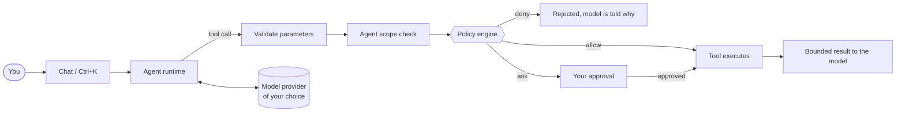

<p align="center">
  
</p>

<h1 align="center">Vader</h1>

<p align="center">
  <b>The AI-native IDE for agents you can trust.</b><br>
  An open-source code editor that pairs a full VS Code workbench with an autonomous coding agent,<br>
  governed by a hard policy engine that sits in front of every action it takes.
</p>

<p align="center">
  Bring any model &middot; 49 providers, local or hosted &middot; No telemetry &middot; Apache-2.0
</p>

<p align="center">
  <a href="https://github.com/qwzx4893-stack/Vader/actions/workflows/ci.yml"></a>
  <a href="https://github.com/qwzx4893-stack/Vader/actions/workflows/security-scan.yml"></a>
  <a href="https://github.com/qwzx4893-stack/Vader/actions/workflows/windows-e2e.yml"></a>
  <a href="https://github.com/qwzx4893-stack/Vader/releases"></a>
  <a href="./LICENSE.txt"></a>
</p>
<p align="center">
  
  
  
  
  
  
  
</p>
<p align="center">
  <a href="https://github.com/qwzx4893-stack/Vader/stargazers"></a>
  <a href="https://github.com/qwzx4893-stack/Vader/issues"></a>
  
  
</p>

<p align="center">
  <a href="#why-vader">Why Vader</a> ·
  <a href="#vader-at-a-glance">At a glance</a> ·
  <a href="#features">Features</a> ·
  <a href="#the-policy-engine">Policy engine</a> ·
  <a href="#models-and-providers">Models</a> ·
  <a href="#privacy">Privacy</a> ·
  <a href="#install">Install</a> ·
  <a href="#how-vader-is-verified">Verification</a> ·
  <a href="#roadmap">Roadmap</a> ·
  <a href="#built-on-the-shoulders-of">Built on</a> ·
  <a href="#faq">FAQ</a> ·
  <a href="./README.ar.md">العربية</a>
</p>

---

## Overview

Vader is a desktop IDE built for software teams and individuals who want the speed of an AI agent without surrendering control of their machine. It combines three things that are usually separate products:

1. **A complete editor.** The full VS Code workbench (terminal, debugging, source control, themes, the Open VSX extension gallery), so nothing you rely on is missing.
2. **An autonomous coding agent.** It reads and edits files, runs commands, drives a real browser, uses MCP servers and skills, and delegates work to sub-agents isolated in git worktrees.
3. **A policy engine that the agent cannot talk its way past.** Every tool call is evaluated by deterministic rules before it runs: dangerous actions are denied outright, sensitive ones need your approval, and the rest flow freely. The check lives in code, not in a prompt.

You choose the model. Vader speaks natively to 49 providers (OpenAI, Anthropic, Google, xAI, DeepSeek, Mistral, Qwen, Kimi, NVIDIA, and many more, plus Ollama, LM Studio and vLLM for fully local use), lists the models your key can actually use, and sends nothing to anyone but the provider you configured.

## Why Vader

An AI agent that can edit your files and run commands is the most useful thing in your editor and the most dangerous. Most AI editors hand it your machine and ask you to click "approve" a few hundred times a day until you stop reading. A prompt injected into a README, a web page or an MCP result can then do whatever you could.

Vader is built around the opposite rule: **never trust, always gate.** The agent is treated like a new engineer with real access to your files and terminal. Everything it does passes through a policy engine implemented in code, in front of the approval prompt, whatever the model was told and whatever the model decides. It is also built so that you can check that claim yourself: the repository ships the attacks it was tested against and the tools to run them.

## Vader at a glance

| | |
|---|---|
| **43** built-in agent tools | files, search, terminal, browser, verification, MCP and skill discovery, memory, sub-agents |
| **49** model providers | each native in Settings (not only through OpenRouter), searchable, any OpenAI-compatible endpoint besides |
| **0** telemetry | no analytics, no phone-home, checked with a network trace in the test suite |
| **0** known advisories | enforced by a test across all 58 lockfiles, including build tooling |
| **~23** regression suites on every push | policy bypass attempts, provider wire formats, privacy flags, packaged-import checks |
| **60+** end-to-end scenarios | the *installed* Windows app driven through its UI, including a real model |

## Features

### A real agent, not a chat box
Reads and edits files with precise search/replace edits, runs commands in a real terminal (including persistent ones), searches code, and checks its own work. Edits are applied through a streaming diff you can accept or reject, with checkpoints you can restore. Inline **Ctrl+K** quick edits and **Apply** from any code block are built in.

### Tools beyond the editor
- **Browser:** 15 Playwright-backed tools (navigate, snapshot, click, type, screenshot, console / network / page-error logs) in isolated pages. File URLs and local pages are refused.
- **MCP:** servers are configured in `mcp.json` with one-click setup from a registry; their tools can be exposed lazily so the model is not buried in schemas. Servers get a safe environment, never yours.
- **Marketplace:** one search across extensions (Open VSX), skills (SkillNet) and MCP servers. Installing anything always asks first.

### Multi-agent orchestration
Permanent named agents with their own instructions, tool allow-lists and file scope; one-off sub-agents; research and browser delegates; parallel tasks isolated in **git worktrees** so two agents can never step on each other's changes.

### It checks its own work
An independent **verification agent**, hard-enforced read-only and with no memory of how the change was made, judges whether a task actually succeeded, with a bounded verify → repair → re-verify loop. Plan and Gather modes are read-only *in code*, not just in the prompt.

### Context that stays relevant
A per-turn context engine ranks symbols, diagnostics and git history instead of dumping the repository at the model. Memory and structured compaction keep long sessions coherent, and tool results are bounded so a 30 MB file cannot flood a request.

### The editor you already know
The full VS Code workbench: integrated terminal, source control, debugging, themes, keybindings, and the Open VSX extension gallery. Everything you use today is still there.

## The policy engine

Every file read/write/delete, terminal command, MCP call and installation is evaluated by rules **before it runs**. A `deny` cannot be approved; an `ask` forces a prompt even if you auto-approve that category; rules marked `locked` cannot be turned off from settings.

| Decision | Examples (built in) |
|---|---|
| **deny** (locked) | recursive delete of a root, home, system or drive directory · disk wipes · fork bombs · writing or deleting OS-critical files (`/etc/shadow`, `/etc/sudoers`, `C:\Windows`, ...) |
| **ask** | secrets and keys (`.env`, SSH and cloud credentials, certificates, shell history, browser credential stores, `/proc/*/environ`) · files that run code later (`.vscode/tasks.json`, git hooks, `.envrc`, shell profiles, `mcp.json`) · `sudo` · force-push · `curl \| sh` · installing a skill, extension or MCP server |

Details that matter:

- Paths are resolved through **symbolic links and `..`** before rules see them, so `docs/credentials` pointing at `~/.aws` does not slip past a secrets rule, and `src/../../etc/shadow` does not slip past a system-file rule.
- Terminal commands are normalised (quotes, unicode look-alikes, escapes) before matching; user-written regexes are checked for catastrophic backtracking and **fail closed**.
- A permanent agent's file scope is enforced on every path, written and resolved.
- Add your own rules in settings; the engine, its rules and every bypass attempt it is tested against are in [`src/vs/workbench/contrib/vader/common/policy/`](./src/vs/workbench/contrib/vader/common/policy/) and [`policyBypassE2E.mjs`](./src/vs/workbench/contrib/vader/test/policyBypassE2E.mjs) / [`symlinkPolicyE2E.mjs`](./src/vs/workbench/contrib/vader/test/symlinkPolicyE2E.mjs).

It is a gate, not a sandbox: a command you approve runs with your account's permissions. [`SECURITY.md`](./SECURITY.md) says exactly what is and is not protected.



## Models and providers

| | |
|---|---|
| **Frontier labs** | OpenAI · Anthropic · Google Gemini · xAI · Mistral · DeepSeek · Cohere · Z.AI (GLM) · Moonshot (Kimi) · Alibaba (Qwen) · MiniMax · StepFun · Xiaomi MiMo · Perplexity · AI21 · Upstage · Inception · Meta Llama API |
| **Inference platforms** | Together AI · Fireworks · Groq · Cerebras · SambaNova · NVIDIA NIM · Hugging Face · DeepInfra · Nebius · Cloudflare Workers AI · Novita · SiliconFlow · Volcengine Ark · Baseten · Scaleway · OVHcloud · Venice · Hyperbolic · GitHub Models |
| **Gateways and clouds** | OpenRouter · Vercel AI Gateway · Requesty · OpenCode Zen · LiteLLM · Azure OpenAI · AWS Bedrock · Google Vertex AI |
| **Local** | Ollama · LM Studio · vLLM (no key, models auto-detected) |
| **Anything else** | any OpenAI-compatible endpoint with a custom base URL |

Every provider is its own entry in Settings with its own key and an editable gateway, and the list is searchable (`qwen`, `kimi`, `together`, `nvidia` ...). With a key, Vader asks the provider which models that key can use. The gateway URLs come from vendor documentation and are not live-verified by the project's tests (see [`PROVIDERS.md`](./PROVIDERS.md)).

Keys are encrypted with your OS keychain. Models without native tool-calling (common locally) use an XML tool grammar automatically. You can pick a different model per feature (chat, Ctrl+K, autocomplete, apply, commit messages). Provider details: [`PROVIDERS.md`](./PROVIDERS.md).

## Privacy

Vader contacts exactly what you configure: your model provider, the extension gallery, and pages you or the agent open. There is no telemetry and no update beacon. Chromium's own background services (spell-check dictionaries, autofill, network time, component updates) are switched off in the editor and in the agent's browser, and a test launches the packaged app and **fails on any request to a non-local host**. The two residual contacts that cannot be switched off from the command line are documented, with reasons, in [`docs/integrations/privacy.md`](./docs/integrations/privacy.md).

## Install

> Installers are currently **unsigned**: Windows SmartScreen will warn on first run.

- **Windows:** the [**Releases**](https://github.com/qwzx4893-stack/Vader/releases) page has the published installer. Newer builds (current editor base, everything described here) are produced by the [Windows Build](https://github.com/qwzx4893-stack/Vader/actions/workflows/windows-build.yml) workflow as an installer artifact on every run.
- **macOS / Linux:** the same pipeline applies; build from source until installers are published ([below](#build-from-source)).

### First five minutes

1. Open Vader and pick a provider in the first-run setup (or point it at a local one such as Ollama).
2. Open a folder and switch the chat to **Agent** mode. Describe the task.
3. Edits and commands ask before they run. Decide how much to auto-approve in settings, knowing that policy `ask` rules still ask.
4. Put project instructions for the agent in a `.vaderrules` file at the workspace root.

| Shortcut | |
|---|---|
| <kbd>Ctrl/Cmd</kbd>+<kbd>L</kbd> | Add the selection to chat |
| <kbd>Ctrl/Cmd</kbd>+<kbd>K</kbd> | Quick edit the selected code |
| <kbd>Ctrl/Cmd</kbd>+<kbd>Shift</kbd>+<kbd>P</kbd> | Command palette (`Help: About` for version info) |

## Build from source

Requirements: Node.js 24 (see [`.nvmrc`](./.nvmrc)), Git, and the usual native build tools for your OS ([details](./CONTRIBUTING.md#prerequisites)).

```bash
git clone https://github.com/qwzx4893-stack/Vader.git
cd Vader
npm install
npm run buildreact     # the React chat / settings UI
npm run buildcline     # the agent runtime bundle for the renderer
npm run compile
./scripts/code.sh      # macOS / Linux   (scripts\code.bat on Windows)
```

Read [`AGENTS.md`](./AGENTS.md) and [`CONTRIBUTING.md`](./CONTRIBUTING.md) before changing the agent platform.

## How Vader is verified

- **Regression tests on every push** ([CI](./.github/workflows/ci.yml)): policy bypass attempts (symbolic links, `..`, regex bombs, obfuscated commands), provider wire formats against the real vendor SDKs, privacy flags, packaged-import checks, import cycles, and a gate that requires **zero known advisories** in every lockfile.
- **The real app, end to end** ([Windows E2E](./.github/workflows/windows-e2e.yml)): the installed app is driven through its UI with a scripted model (every tool, edits, approvals, restart persistence, fault injection such as invalid JSON, endless tool loops and prompt injection hidden in files) and with a small real model.
- **Security scanning** ([Security Scan](./.github/workflows/security-scan.yml)): CodeQL, Semgrep, secret scanning, dependency audit, workflow linting.
- **A model in the loop:** [`agentBridge.mjs`](./src/vs/workbench/contrib/vader/test/e2e/agentBridge.mjs) hands every request the app sends to its model to a person or an AI agent, so you see exactly what a keyed model would experience. [`docs/AGENT_SESSIONS.md`](./docs/AGENT_SESSIONS.md) lists what that found and how each issue was closed.
- **Compared with peers:** [`docs/QUALITY_COMPARISON.md`](./docs/QUALITY_COMPARISON.md) measures code and agent mechanisms against comparable open-source projects.

What is *not* measured yet is written down too: [`docs/PRODUCT_ASSESSMENT.md`](./docs/PRODUCT_ASSESSMENT.md).

## Project layout

```
src/vs/workbench/contrib/vader/   Vader's own code: agent runtime, tools, policy engine, providers, chat UI (React)
  common/policy/                   the policy engine and its rules
  browser/ electron-main/          chat thread service, tool implementations, main-process services
  test/                            regression tests and the real-app E2E suite
build/                             packaging, installer, patched build tools (build/stubs)
brand/  docs/assets/               logos and banner (generated by build/lib/vader/make_brand_assets.py)
docs/                              architecture guides, assessments, per-subsystem integration docs
.github/workflows/                 CI, security scan, Windows build / E2E / smoke
```

## Roadmap

Honest status, with the reasoning in [`docs/PRODUCT_ASSESSMENT.md`](./docs/PRODUCT_ASSESSMENT.md) and [`ROADMAP.md`](./ROADMAP.md):

- [x] Policy engine, multi-agent, verification, browser, MCP, marketplace, privacy checks
- [x] Windows build, installer, end-to-end suite against the installed app
- [x] Zero known advisories across the dependency tree, enforced in CI
- [ ] Code-signed installers and an update channel
- [ ] macOS and Linux installers built and tested in CI
- [ ] Task-success benchmark with a strong model (pass@k) and long-session soak tests
- [ ] Opt-in, local-first crash reports

## FAQ

**Is it free?** Yes. Vader is open source under Apache-2.0 (see [License](#license-and-credits)). You pay your model provider directly, or nothing if you use a local model.

**Does it send my code anywhere?** Only to the model provider you configure, for the requests you make. Nothing goes to us: there is no server.

**Can the agent delete my files?** Only what you approve, and never what a locked rule denies. Catastrophic commands are blocked outright, and anything touching secrets, startup files or installs asks first.

**Does it work with local models?** Yes: Ollama, LM Studio and vLLM need no key. Small local models are weaker agents; see the real-model results in [`docs/QUALITY_COMPARISON.md`](./docs/QUALITY_COMPARISON.md).

**Can I use VS Code extensions?** Yes, from the Open VSX gallery.

More answers in [`docs/FAQ.md`](./docs/FAQ.md).

## Documentation

| | |
|---|---|
| [`ARCHITECTURE.md`](./ARCHITECTURE.md) | How the platform is put together and where to extend it |
| [`PROVIDERS.md`](./PROVIDERS.md) | The provider matrix and its limits |
| [`docs/integrations/`](./docs/integrations/) | One guide per subsystem (policy, MCP, agents, marketplace, privacy, build, testing) |
| [`docs/AGENT_SESSIONS.md`](./docs/AGENT_SESSIONS.md) | Driving the real app as the model; vulnerabilities found and fixed |
| [`docs/QUALITY_COMPARISON.md`](./docs/QUALITY_COMPARISON.md) | Quality measured against comparable projects |
| [`docs/CODEBASE_GUIDE.md`](./docs/CODEBASE_GUIDE.md) | A tour of the codebase |
| [`SECURITY.md`](./SECURITY.md) | Reporting a vulnerability; what the policy engine does and does not protect |
| [`CHANGELOG.md`](./CHANGELOG.md) | What changed |

## Contributing

Issues and pull requests are welcome: start with [`CONTRIBUTING.md`](./CONTRIBUTING.md). Questions go to [Discussions or issues](https://github.com/qwzx4893-stack/Vader/issues); see [`SUPPORT.md`](./SUPPORT.md). Report security problems privately as described in [`SECURITY.md`](./SECURITY.md).

If Vader is useful to you, a star helps other people find it.

[](https://star-history.com/#qwzx4893-stack/Vader&Date)

## Built on the shoulders of

Vader stands on excellent open-source work, and says so plainly. The projects below are integrated into the product; each remains under its own licence and belongs to its authors.

| Project | What Vader uses it for | Licence |
|---|---|---|
| [**VS Code**](https://github.com/microsoft/vscode) (Microsoft) | The editor workbench Vader is built on (currently the 1.136 line): editor, terminal, debugging, source control, extensions host | MIT |
| [**Void**](https://github.com/voideditor/void) (Glass Devtools) | The open-source AI editor Vader was originally forked from; its chat, quick-edit, diff and provider foundations are the starting point of Vader's AI layer | Apache-2.0 |
| [**Cline**](https://github.com/cline/cline) | The agent runtime: Vader runs every conversation through the Cline agent SDK (`@cline/agents`), with Vader's policy engine, approvals and verification wrapped around it | Apache-2.0 |
| [**Model Context Protocol**](https://modelcontextprotocol.io) | MCP client for tools, with registry-based one-click setup | MIT |
| [**Playwright**](https://playwright.dev) (Microsoft) | The browser backend behind the 15 browser tools | Apache-2.0 |
| [**Open VSX**](https://open-vsx.org) (Eclipse Foundation) | The extension gallery | EPL-2.0 |
| **SkillNet** (OpenKG) | Skill discovery and installation in the unified marketplace | see the project |
| [**models.dev**](https://github.com/sst/models.dev) | Model and provider catalogue data behind the provider table | MIT |
| [**lobe-icons**](https://github.com/lobehub/lobe-icons), LiteLLM and Requesty icon sets | The provider logos shown in Settings (marks belong to their owners and identify the provider only) | MIT |

Vader is an independent project and is not affiliated with or endorsed by any of the above. The full third-party notices are in [`ThirdPartyNotices.txt`](./ThirdPartyNotices.txt).

## License and credits

Vader's own code is licensed under the **Apache License 2.0** ([`LICENSE.txt`](./LICENSE.txt)). It is built on the open-source VS Code workbench (MIT, see [`LICENSE-VS-Code.txt`](./LICENSE-VS-Code.txt)) and on earlier open-source work by Glass Devtools, Inc. (the Void editor, Apache-2.0), with the Cline agent runtime (Apache-2.0) at its core; third-party notices are in [`ThirdPartyNotices.txt`](./ThirdPartyNotices.txt). Those notices are preserved as the licenses require. Cite Vader with [`CITATION.cff`](./CITATION.cff).
